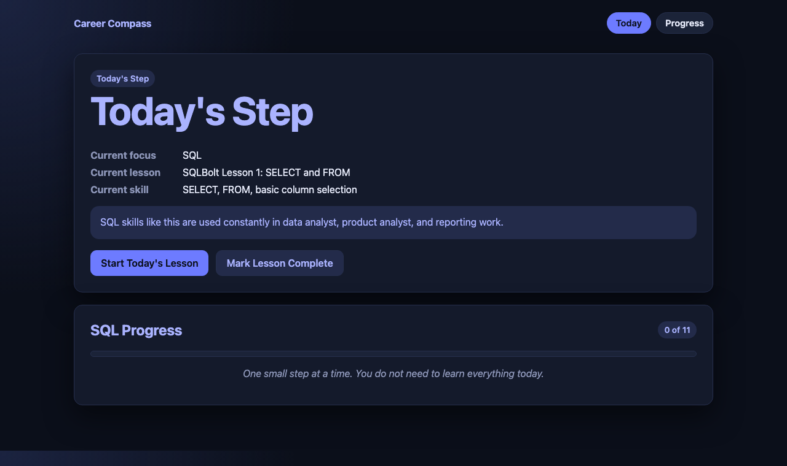

# Career Compass

A browser based learning system that turns structured SQL and Python practice into tracked progress, skill checks, and portfolio evidence.

[View Live Demo](https://emmawichmann.github.io/careercompass/) | [View Repository](https://github.com/EmmaWichmann/careercompass)



## Overview

Career Compass is a personal learning and career-development tool that I design, build, and use myself. Instead of a dashboard of competing options, it recommends one lesson at a time, tracks completion automatically, and turns that activity into plain-language progress evidence tied to a real certification roadmap.

## The Problem

While preparing for several adjacent technology roles — data analyst, product analyst, product manager, AI implementation, and software engineering — my learning materials were spread across separate tutorials, courses, personal notes, and trackers, with no single source of truth for what to work on next or what I had actually learned. Self-directed practice was easy to start and hard to turn into evidence I could use in a resume or interview.

## How It Works

- **Today** recommends exactly one SQL or Python lesson at a time, pulled from a real external course (SQLBolt, LearnPython.org).
- Marking a lesson complete logs progress automatically and reveals a matching skill check from a custom quiz engine.
- Once every SQL lesson is complete, Today automatically shifts its recommendation to Python.
- **Progress**, **Certifications**, and **Career** all read from the same stored data, so information stays consistent instead of duplicated across pages.
- The whole system is static HTML, CSS, and JavaScript with no backend; all state lives in the browser's `localStorage`.

## Current Features

- **Today** — one recommended lesson, a short note on why it matters, a link to the real lesson, and a Mark Lesson Complete action.
- **Progress** — lessons completed, skill checks passed, recent wins, and a collapsed future roadmap.
- **Skill Checks** — 20-question quizzes with an 80% pass threshold, a recommendation for the next SQL concept check, and an archive of earlier HTML/CSS/JS assessments.
- **Certifications and Career** — the active certification target, a readiness summary, and the role cluster behind the roadmap.
- **Notes** — a searchable library of analogies, key concepts, and practice questions in collapsed categories.
- **Local browser storage and link checking** — all progress stays in `localStorage` with no account or server, and a Node script checks the repository for broken internal links.

## Technology

- Plain HTML, CSS, and vanilla JavaScript — no framework, no build step, no dependencies.
- Deployed as a static site via GitHub Pages.
- A custom exam engine (`shared/exam-engine.js`, `data/exam-data.js`) that generates quizzes from structured topic data. It covers 10 languages internally; the live UI currently focuses on SQL and Python.
- Client-side persistence with `localStorage` — no database, no authentication, no server.
- A dependency-free Node.js script (`scripts/check-links.js`) that checks internal links across the repository.

## AI-Assisted Development Workflow

I build Career Compass using Claude and Codex to accelerate implementation, while I define requirements, review every generated change, and decide what ships. This keeps development fast without giving up ownership of the product or the code.

My workflow is to test functionality in the browser, inspect for errors, and document decisions as I go, then commit in small, incremental steps — the repository's commit history reflects that pattern, including several commits with recorded AI co-authorship. I'm early in my technical career, and this workflow lets me focus on product thinking and problem-solving while building hands-on coding fluency in parallel.

## Career Compass and EmmaGetsHired Ecosystem

Career Compass and EmmaGetsHired are two connected products built as part of the same career strategy:

- **Career Compass** (this project) — the learning and strategy engine: daily practice, skill checks, and progress evidence.
- **[EmmaGetsHired](https://emmawichmann.github.io/emmagetshired/)** — the job search and application platform.
- Today they are separate deployed sites with no shared code or data. The plan is for Career Compass progress to eventually support EmmaGetsHired features — a planned direction, not a built integration.

## What I'm Learning and the Roadmap

My active focus is SQL, using SQLBolt, moving through filtering, aggregation, joins, subqueries, and NULL handling. Python is next, using LearnPython.org fundamentals — variables, strings, lists, dictionaries, control flow, loops, and functions.

The certification roadmap Career Compass tracks toward, in order:

1. **SQL / Relational Database** (current) — freeCodeCamp
2. **Python** (next) — freeCodeCamp
3. **APIs + JSON / Data Workflows** — freeCodeCamp
4. **Data Visualization / BI** — freeCodeCamp
5. **AI / Data Foundations** — IBM SkillsBuild

Full reasoning is documented in `notes/CAREER_STRATEGY.md` and `notes/LEARNING_SYSTEM.md`.

## Running the Project Locally

Career Compass has no dependencies and no build step.

1. Clone the repository:
   ```
   git clone https://github.com/EmmaWichmann/careercompass.git
   cd careercompass
   ```
2. Serve the folder with any static file server, for example:
   ```
   python3 -m http.server 8000
   ```
3. Open `http://localhost:8000/` in a browser.
4. Check for broken internal links before committing a change:
   ```
   node scripts/check-links.js
   ```
   This only requires Node.js — there is nothing to `npm install`.

## Project Status

Career Compass is an actively evolving personal project, not a finished or production product. It has no accounts, no backend, and no multi-device sync — all progress lives in the browser's local storage, and the features above reflect the current state of the repository.
